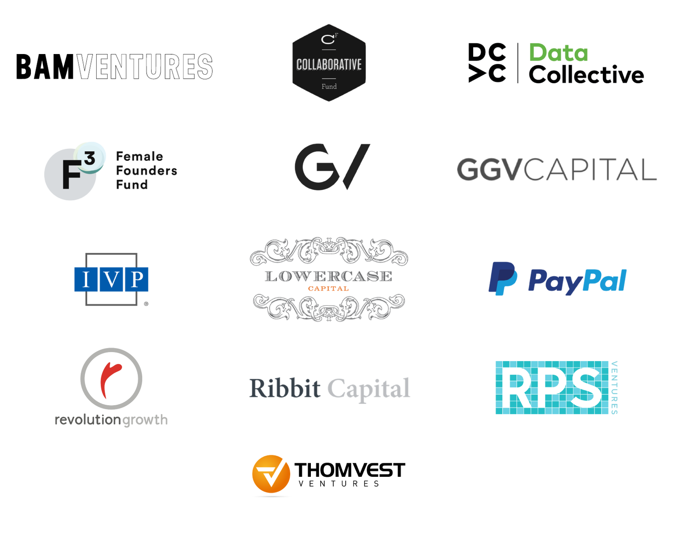

# The rise of Fintech Lending - The story behind TALA  

## Company Overview

<b>[TALA](https://tala.co)</b> was founded in 2014 by Shivani Siroya who is also the current CEO. The company started out offering unsecured loans to people in Kenya. The founder while working for the United Nations Population Fund, noticed that the biggest obstacle to broadening financisal access was lack of data. Realising that non traditional financial data already resides on consumers' mobile phones, she built an app to convert the shared data into a credit score. 
[TALA](https://tala.co) is headquarted in Santa Monica, CA and has offices in Nairobi Kenya, Mexico City Mexico, Manila Phillipines, and Bangalore India. 
 

## Technologies Deployed

[TALA](https://tala.co) interacts with customers through it's mobile App that customers download to their mobile phone. After a customer completes a simple application, [TALA](https://tala.co) uses data science models to analyze the customer's data and makes loan decisions in a few minutes. 
 

[TALA](https://tala.co) uses different technology products and services including:

* HTML5
* Google Analytics
* JQuery
* Viewport Meta
* IPhone/Mobile Compatible
* Company Tech Stack

## Funding and Investors

In February of 2017, IVP lead a group of investors in a $30 million funding for [TALA](https://tala.co). In August, 2019 RPS Ventures a SoftBank Group backed firm led a $110 million Series D financing deal. *TALA's* total funding is **$204.4 million**. The **RPS** deal pushed *TALA* to a valuation in the **$700 million** range. To date, the major institutional  that have ponnied up funding for [TALA](https://tala.co) are:

- BAM VENTURES
- F3 - Female Founders Fund
- CF - COLLABORATIVE FUND
- DC>C - Data Collective
- GV
- GGV CAPITAL
- IVP
- LOWERCASE CAPITAL
- PayPal
- revolution growth
- Ribbit Capital
- RPS
- THOMVEST VENTURES

## Business Activities

> [TALA](https://tala.co) is working to providing financing options to people who lack access to traditional lending options. These are usually people who may not have bank accounts and no credit history, and therefore will not even have access to loan options provided by traditional lending institutions. [TALA's](https://tala.co) business is focused on developing countries in East Africa and Southeast Asia. The company has also entered the Latin American sphere with an office in Mexico City. 

>***The World Bank*** estimate that about 68% of adults have no credit recorded anywhere and therefore no credit score. TALA uses a simple approach to solve a major problem. TALA's major competitive edge is being able to use non-traditional financial data from mobile phone use to analyse customer's potential to pay back loans. 

>A competitior in East Africa - *Branch International* provides microloans in emerging markets such as Tanzania and Kenya. However, TALA has started leveraging data to offer Insurance products. *TALA* estimates it's payback rate at **92%**, which shows their model is working well enough.

## TALA's Impact

*TALA* makes loan as low as $10 to people and so far made over $1 billion in loans to clients. Providing access to capital helps underserved customers build businesses and meet urgent financial needs that are in some instances life and death decisions. TALA is opening up financial markets in East Africa and Southeast Asia to rural and far flung communities, who may not a financial institution for miles, but have a mobile phone.

## Recommendations

An additiopnal product that the company should add to their portfolio is **Money Transfers**. Adding this service will allow gthe customers to transact business and make payments for purchases and services without having to go to a bank which may not be nearby. Money transfer will open up opportunities for the company to build on their success and reach even more clients.
 

Money transfer will require use of various programming languages. Python may be used to pull and analyses tons of data from sources to verify identity and financial profiles of customers requiring services to avoid fraud and money laundering.

## *References:*

1. https://builtin.com/fintech/fintech-lending-applications
2. https://www.crunchbase.com/organization/inventure
3. https://tala.co/
4. https://dev.to/stephencweiss/superscript-and-subscript-with-markdown-4pa5
5. https://www.markdownguide.org/cheat-sheet/
6. https://fortune.com/2019/08/21/tala-shivani-siroya-ggv-softbank-rps-ventures-paypal-raise-india
